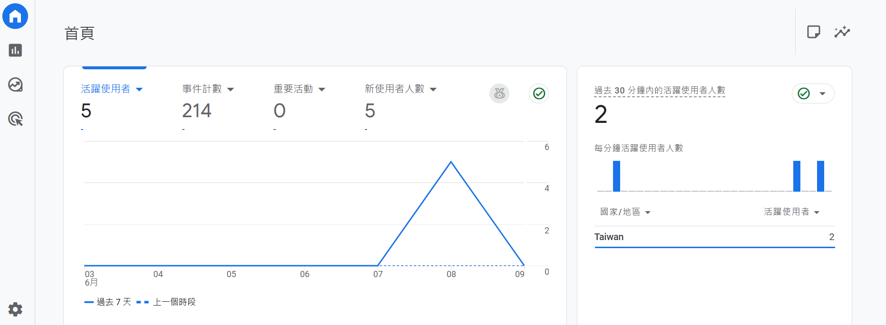

# 2025 六角學院 30 天軟體工程師體驗營最終任務

by 禹成林

體驗營時間：2025-04-24～2025-06-08

[最終任務網站連結](https://useirin.github.io/hex2025LastMission/)

☑ LV1｜Blog 列表頁

☑ LV2｜Blog 文章頁

☑ LV3｜index 首頁

☑ LV3｜串接 GA 分析

## 更新紀錄

2025-05-19｜首次嘗試 BLOG 列表頁，寫出了三頭地獄犬 (有三個＜header＞)，打掉重練 ^q^

2025-05-20｜繳交小組任務 (Blog 的 Banner、Search Bar)

~~補課程進度中~~

2025-05-28｜繳交 Git 小組任務 (05-28～06-03 挑戰加碼任務一～六)

2025-05-29｜BLOG 列表頁完成，繳交 Flex 切版任務

2025-06-02｜依助教建議調整 BLOG 列表頁

~~狂追猛趕每日切版任務進度~~

2025-06-06｜後知後覺發現最終任務不能用 Codepen 交，打掉重練 again ^q^

2025-06-07｜完成 Blog 列表及文章頁

2025-06-08｜串接 Google Analytics，繳交最終任務 (LV2)

~~為什麼輪播不會動QQ~~

2025-06-10｜完成 index 首頁！

2025-06-11｜調整細節並修復一些BUG，更新README